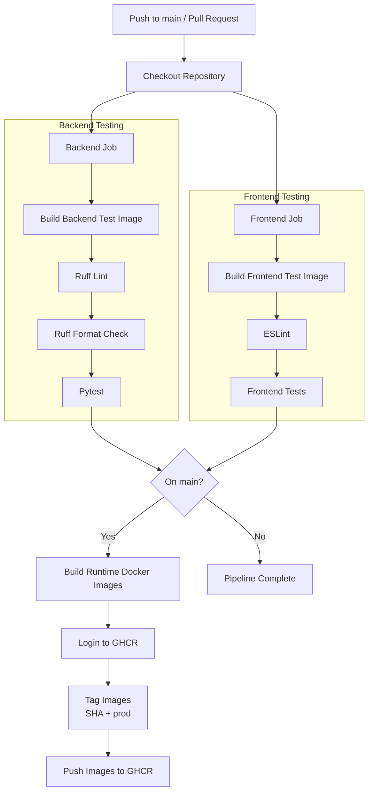
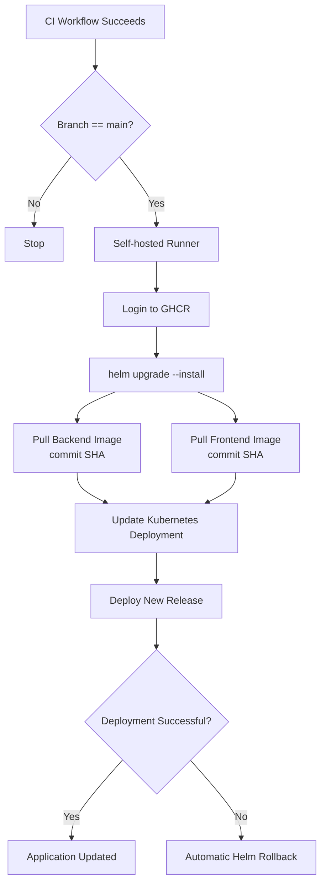
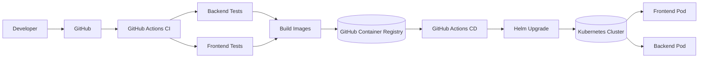

# Overview Of Project

**getkevryx** is a full-stack e-commerce app themed around a premium, modern, outdoor apparel brand. The app provides a complete online shopping experience including product browsing, order placement, order tracking, and a responsive user-interface.

The application is fundamentally build with a React frontend served by NGINX, a FastAPI backend, and a PostgreSQL database. The services are containerized with Docker and deployed using either Docker Compose or Kubernetes depending on the target environment.

Rather than focusing solely on frontend and backend development, this project aimed to replicate a production style infrastructure. It showcases containerization, orchestration, automated CI/CD pipelines, and monitoring—bringing together the technologies commonly used to deploy and operate modern cloud-native applications.

**TLDR; The primary goal of this project was to gain hands-on experience building, deploying, and operating a cloud-native application using tools commonly found in modern production environments.**

## Overview of Deployment Platforms

The project was deployed in two different environments:

- **AWS EC2** – A cloud deployment using Docker Compose. Kubernetes was intentionally omitted to reduce infrastructure costs.

- **Local Ubuntu Server** – A production-style deployment running the complete infrastructure, including Kubernetes, Helm, Prometheus, Grafana, Redis, and the application stack.

 

## Tech Stack

### Frontend
- React
- Vite

### Backend
- FastAPI
- SQLAlchemy
- PostgreSQL

### DevOps & Infrastructure
- Docker
- Docker Compose
- Kubernetes
- Helm
- NGINX
- Redis
- GitHub Actions
- Prometheus
- Grafana

## CI/CD Pipeline Diagrams
### Continuous Integration (CI)

### Continuous Development (CD)

## Full CI/CD Pipeline

